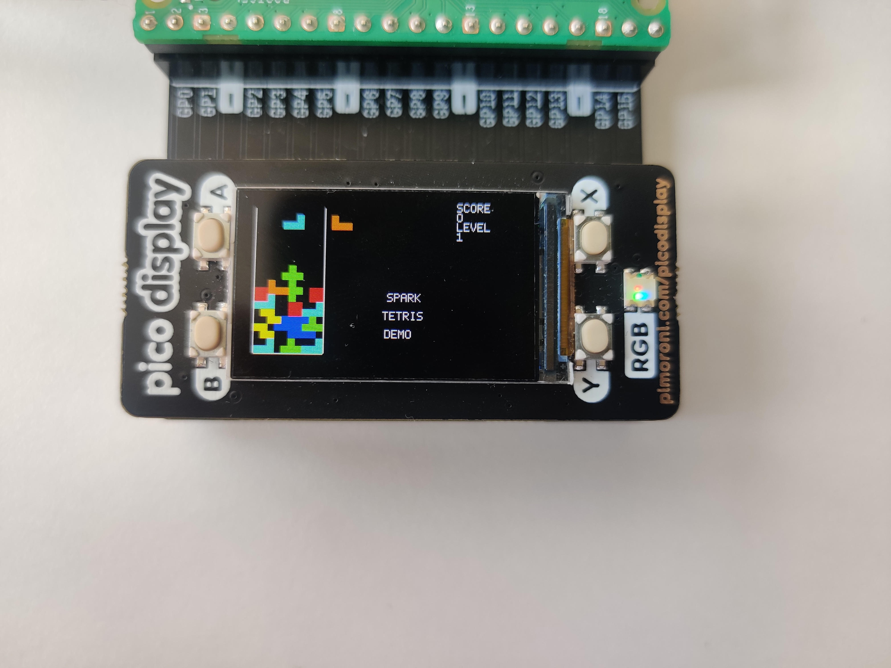

# tetris

SPARK tetris example for Raspberry Pico Display 

# Build and try the tetris

Clone the repo and go to the main directory:
```console
$ git clone --recurse-submodules https://github.com/elsaferrara/tetris
$ cd tetris
```

Build with [Alire](https://alire.ada.dev):
```console
$ alr build
```


